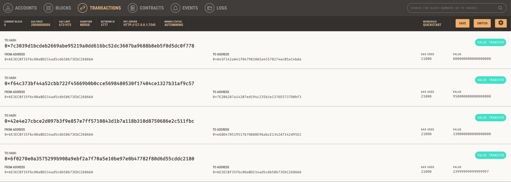
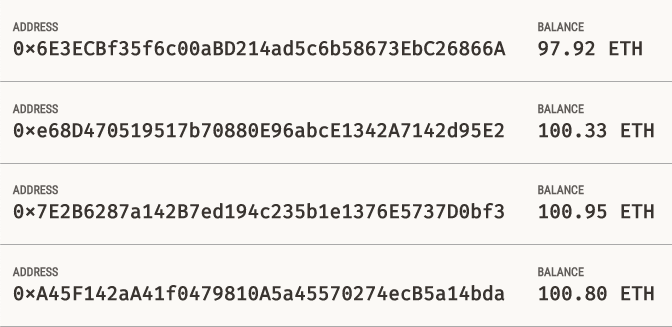

# Blockchain Ledger
## Objective
Integration of the Ethereum blockchain network into the application for the purpose of enabling customers to instantly pay hired fintech professionals with cryptocurrency.

#### Note: To run, please add your ganache's MNEMONIC seed phrase in the SAMPLE.env file. All code is ran from "krypto_jobs.py" within the web interface of the application and the "crypto_wallet.py" contains the functions for the Ethereum transactions.

## Results

  ### Transactions - GANACHE (listed as in screenshot order)
  

   Employer Ethereum Account Address: 0x6E3ECBf35f6c00aBD21*******************
  
  1) Sent Kendal wages for 5 hours == Ethereum Account Address: 0xA45F142aA41f0479810******************
  2) Sent Jo wages for 5 hours == Ethereum Account Address: 0x7E2B6287a142B7ed*******************
  3) Sent ASH wages for 1 hour == Ethereum Account Address: 0xe68D470519517b70880*******************
 
  
  ## Account Balances - GANACHE
  
  
  1) Kendal's == Ethereum Account Address: 0xA45F142aA41f0479810******************
  2) Jo's == Ethereum Account Address: 0x7E2B6287a142B7ed*******************
  3) Ash's == Ethereum Account Address: 0xe68D470519517b70880*******************
  4) Employer's == Ethereum Account Address: 0x6E3ECBf35f6c00aBD21*******************
     

  ## Interface - STREAMLIT 
  
     
## Resources & Dependencies
- streamlit
- dataclasses
- typing
- requests
- dotenv
- web3
- os
